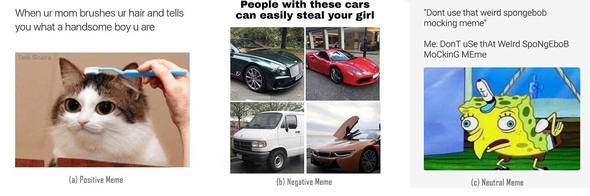

# MemSem : A Multi-modal Framework for Sentimental Analysis of Meme

> Abstract—In the age of internet, Memes have grown to be one of the hottest subjects on the internet and arguably, the most common kind of comedy seen on social media platforms nowadays. Memes are visual illustrations combined together with text which usually convey funny meaning. People use memes to express themselves on social media platform by posting them. But despite of their huge growth, there is not much attention towards meme sentimental analysis. Our goal is to predict the sentiment hidden in the meme by the combined analysis of visual and textual attribute. We propose a multimodal deep neural network framework for sentiment analysis of memes. 
> Our proposed model utilizes VGG19 pre-trained on ImageNet dataset and BERT  language model to learn the visual and textual feature of the meme and combine them together to make predictions. The performance of the proposed MemeSem model is compared with various baseline models . The experimental dataset was prepared of 10,115 internet memes with three sentiment classes-classes- (Positive, Negative and Neutral) and further training and evaluation was performed on it. Our proposed model outperforms the baseline multimodals and independent unimodals based on either images or text. On an average MemeSem outperform the unimodal and multimodal baseline by 19.02% and 8.53%.

Recent developments in Deep Learning has paved the way to accomplish tasks involving multimodal learning. Meme's emotion analysis is one such challenge which requires high-level scene interpretation from images combined with language modelling of relevant text. Given an image and a natural language text about the image, the task is to provide an accurate classification about the meme , whether it's offensive , funny or non-sense. This is a [tensorflow](https://www.tensorflow.org/api_docs/python/) implementation of one such end-to-end system to accomplish the task.

## Architecture
The learning architecture behind this is based on the model proposed in the [MemSem paper](https://drive.google.com/file/d/1eAbbQLemseaGMdHrmFjukQZUG1vqVbfL/view?usp=sharing).


The architecture is trained with data downloaded from [Reddit](https://www.reddit.com/](https://www.reddit.com/)'s meme pages. The images can be classified in 3 categories: Postive Meme, Negative meme, Neutral Meme. These images are preprocessed using `preprocessing.py` and the embedded text is extracted using [tesseract-ocr](https://tesseract-ocr.github.io/) and [pytessaract](https://github.com/madmaze/pytesseract) and further processed using `datagen.py`. The preprocessed images are then fed to the [VGG19](https://arxiv.org/abs/1409.1556) for image feature extraction and the preprocessed text is further tokenized and fed into [BERT-base-uncased](https://arxiv.org/abs/1810.04805) for text feature extraction. The features extracted from two different modalities are concatenated and passed through a pair of fully connected layers for classification.

## Installation
Scripts in this repository is a  [Tensorflow 2.1.0](https://www.tensorflow.org/api_docs/python/) implemetation. Still some of the packages are also needed. Some of them are:
- [Hugging Face Transformer](https://huggingface.co/transformers/)
- [Natural Language Toolkit](https://www.nltk.org/)
- [PRAW](https://praw.readthedocs.io/)
- [Pytessaract](https://github.com/madmaze/pytesseract)
- [Selenium](https://www.selenium.dev/documentation/en/)

Some of the toolkits like [Tesseract-ocr](https://tesseract-ocr.github.io/) and [chromedriver](https://chromedriver.chromium.org/) are also required.
### Linux User
Run the shell file `install.sh` on your system.

### Windows User
You'll be needing to installing Tesseract-ocr toolkit for your system. Please go through [**this**]([https://github.com/tesseract-ocr/tesseract](https://github.com/tesseract-ocr/tesseract)).  After that run the command 
`pip install -r requirements.txt` 
in you command shell.


## Dataset
We acquired the data or the images based on reviews and opinion of peoples on the internet. There were a large number of memes present on sub [Reddit](https://www.reddit.com/)'s pages. We took the dataset from the following sub reddit pages:
- [r/wholesomememes](https://www.reddit.com/r/wholesomememes/): This sub reddit page contents were reviewed as influential and funny in good sense.
- [r/darkmeme](https://www.reddit.com/r/darkmeme/): This sub reddit page contents were reviewed as the most offensive memes.
- [r/antimeme](https://www.reddit.com/r/antimeme/): This sub reddit page contents were reviewed as meaningless meme meaning it was not influential, no humor, no meaningful contents and were neither offensive.

To extract the dataset we used [PRAW](https://praw.readthedocs.io/). It's also called **P**ython **R**eddit **A**PI **W**rapper. It's a wrapper class for Reddit's API, which help in retrieving data from Reddit. 

We also used [google-images-downloader](https://google-images-download.readthedocs.io/). It's a python script and a command line function to download images from google image search. It utilizes the package `selenium` and a software `chromedriver`, to search and download image. In our case we use command line method to download the data.
To download the data run `redditDownloader.py` and/or run `download.sh`. The dataset will be saved in folder `/dataset/positive`, `/dataset/negative` and `/dataset/neutral`.

After that run `datagen.py` for preprocessing, image to array transformation, text extraction and label encoding. The data will be saved in as python's dictionary data structure and will be further saved as `data.pkl`.

## Train
To train the architecture run `train.py`. It will load the `data.pkl`, and train it on that data. It will then save the weights in folder `./MemSem`. You can use the `model.py` for evaluation and testing.

# Collaborators
- [Raj Ratn Pranesh](https://rajratnpranesh.github.io/)

# Cite
```
@inproceedings{Pranesh2020MemeSemAMF,
  title={MemeSem:A Multi-modal Framework for Sentimental Analysis of Meme via Transfer Learning},
  author={R. R. Pranesh and Ambesh Shekhar},
  year={2020}
}
```
